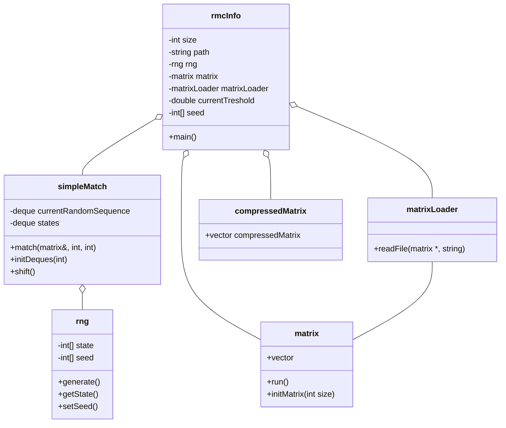

# rmc-info
Random Matrix Compression INterpolation FunctiOn

# Installation
### Command line
- Clone the repository using `git clone https://github.com/mascartcyrille/rmc-info.git`

# Maintenance
### Command line
- Run `git status` to know the names of the files that have been modified/are new
- Run `git add file_names` to add the files for the next commit
- Run `git commit -m "Commit message"` to commit the previously added files. The Commit message summarizes the files that are added to the commit save.
- Run `git pull` for getting remote modifications to the files. Solve the eventual merge conflicts that appear.
- Run `git push` to put your modifications on the remote server.

# Class diagrams

